# 基于SSM的4K壁纸分享网站

### 效果图部分

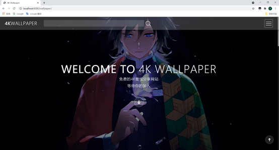

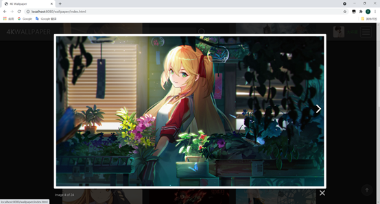

### 哔哩哔哩演示地址

https://www.bilibili.com/video/BV19v411n74q/

## PS

用了本地tomcat的虚拟路径

~~~ xml
<Context path="/images" docBase="E:\Java\Java03作业\images" debug="0" reloadable="true"/>
~~~

## 开发运行环境

- IDEA2020.3.2
- JDK13.2
- MySql5.5
- TomCat 9.0.39
- Chrome 91.0.4472.114
- windows 10

## 主要功能

1. 非登录用户：没有登陆的用户可以查看图片并下载图片，但是不能进行上传图片和图片的点赞功能。因为涉及到不是所有用户都愿意登录站好后下载图片，可能只是需要不想那么麻烦，所有用户可以不用登陆的下载图片等操作。
2. 用户注册：没有登录的用户可以通过用户注册，注册一个属于自己的账号，方便日后的使用。注册时系统会查询是否重复的用户名，只要没被注册的用户名即可使用，还需要注意一下格式。
3. 用户登录：注册完成后，用户既可以登录系统。用户登录后除了浏览下载图片等功能外，增加了上传图片的功能可以把自己的图片分享到该网站。图片点赞功能，删除图片、我的收藏等功能。
4. 图片上传：用户登陆后可以上传图片，上传过程中图片越大上传时间可能越长。也可以上传多个图片。上传前输入图片的相应内容标签即可。
5. 个人中心：用户通过点击个人中心进入个人中心，能看到自己上传的图片，并作相应的删除作品。
6. 我的收藏：用户通过点击我的收藏可以看到自己点赞过的图片，方便查看和瞎咋。
7. 修改密码：用户通过点击修改密码，同时也可以修改用户名。只要用户名不重复即可。
8. 图片搜索：用户在登录和非登录状态下都可以根据关键字，进行相应图片的搜索，搜索后会显示相应的图片
9. 图片的显示：首页会默认显示最新发布的图片，用户在上传后，首页就会显示用户刚刚上传的图片。还有根据热度进行排行，根据点赞数对图片的顺序进行排序，达到大家喜爱的图片最先显示等。
10. 加载更多：点击加载更多或嗲用ajax获取更多的图片显示到浏览器上供用户的使用和下载。
11. 用户退出：用户通过点击退出按钮即可退出自己的账号。

## **3** **项目开发过程**

### **3.1** **系统功能模块**

非登录用户只能使用部分功能。

登录用户可以是用全部功能，主要有图片的上传、图片的管理、图片的收藏、账号密码的修改，以及图片的查看、下载、搜索等。

​                               

图3-1 系统功能图

### **3.2** **数据库设计**

本系统在设计数据库时需要9个表来实现，主要包括用户表imageUser、原图表bigImage、裁剪图表smImage、图片数据表iamgeData、图片时间表imageDate、图片信息表imageMessage、多对多表usertoiamge等。

 

图3-2 总体E-R图

 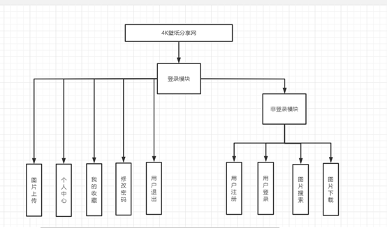

表3-1 用户表

| 字段              | 数据类型       | 主键 | 外键 | 是否为空 | 说明   |
| ----------------- | -------------- | ---- | ---- | -------- | ------ |
| imageUserId       | varchar（255） | 是   | 否   | 否       | 用户id |
| imageUserName     | varchar（255） | 否   | 否   | 否       | 用户名 |
| imageUserPassword | varchar（255） | 否   | 否   | 否       | 密码   |

表3-2 原图表

| 字段                | 数据类型       | 主键 | 外键 | 是否为空 | 说明         |
| ------------------- | -------------- | ---- | ---- | -------- | ------------ |
| bigImageId          | varchar（255） | 是   | 否   | 否       | 图片Id       |
| bigImageAuthor      | varchar（255） | 否   | 否   | 否       | 图片上传者   |
| bigImageSrc         | varchar（255） | 否   | 否   | 否       | 图片路径     |
| bigImageName        | varchar（255） | 否   | 否   | 否       | 图片名称     |
| bigImageDeleteState | varchar（255） | 否   | 否   | 否       | 图片删除状态 |

 表3-3 裁剪图表

| 字段       | 数据类型       | 主键 | 外键 | 是否为空 | 说明     |
| ---------- | -------------- | ---- | ---- | -------- | -------- |
| smImageId  | varchar（255） | 是   | 是   | 否       | 图片Id   |
| smImageSrc | varchar（255） | 否   | 否   | 否       | 图片路径 |

 表3-2 图片数据表

| 字段            | 数据类型       | 主键 | 外键 | 是否为空 | 说明       |
| --------------- | -------------- | ---- | ---- | -------- | ---------- |
| imageId         | varchar（255） | 是   | 是   | 否       | 图片Id     |
| imageResolution | varchar（255） | 否   | 否   | 否       | 图片分辨率 |
| imageSize       | varchar（255） | 否   | 否   | 否       | 图片大小   |
| imageLike       | int（11）      | 否   | 否   | 否       | 图片点赞数 |

 表3-2 图片时间表

| 字段            | 数据类型       | 主键 | 外键 | 是否为空 | 说明         |
| --------------- | -------------- | ---- | ---- | -------- | ------------ |
| imageId         | varchar（255） | 是   | 是   | 否       | 图片Id       |
| imageUpDate     | datetime       | 否   | 否   | 否       | 图片上传时间 |
| imageDeleteDate | datetime       | 否   | 否   | 否       | 图片删除时间 |

 表3-2 图片信息表

| 字段           | 数据类型       | 主键 | 外键 | 是否为空 | 说明     |
| -------------- | -------------- | ---- | ---- | -------- | -------- |
| imageId        | varchar（255） | 是   | 否   | 否       | 图片Id   |
| imageAnimeName | varchar（255） | 否   | 否   | 否       | 相关名称 |
| imageRole      | varchar（255） | 否   | 否   | 否       | 图片主角 |
| imageTags      | varchar（255） | 否   | 否   | 否       | 图片标签 |

 表3-2 多对多表表

| 字段         | 数据类型       | 主键 | 外键 | 是否为空 | 说明   |
| ------------ | -------------- | ---- | ---- | -------- | ------ |
| userAndImage | varchar（255） | 是   | 否   | 否       | 表Id   |
| userName     | varchar（255） | 否   | 否   | 否       | 用户名 |
| imageId      | varchar（255） | 否   | 否   | 否       | 图片Id |

### **3.3** 具体实现

3.3.1 主页访问

用户可以直接访问网站的地址访问图片网站。

 

图3-3-1-1 主页面

用户下滑或者点击下箭头按钮即可加载最新的图片

 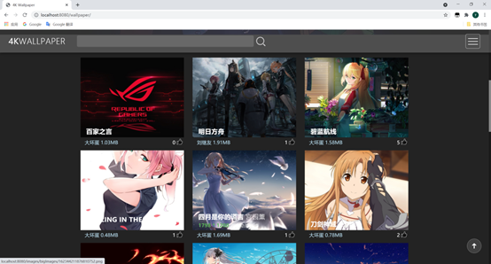

图3-3-1-2 主页面图片显示

点击图片即可查看大图

 

图3-3-1-3 主页大图片显示

 

3.3.2 用户注册

用户登录之前需要先注册账号

 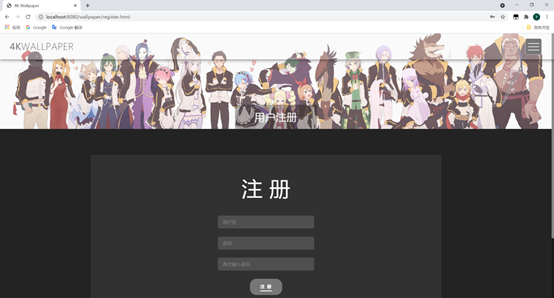

图3-3-2-1 用户注册页面

  用户输入错误信息后，就会有错误提示。并亲用户名重复是会有用户已被注册等提示。

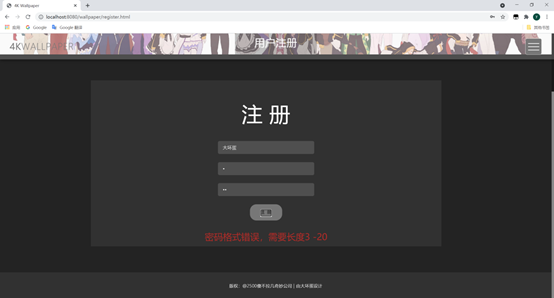

图3-3-2-2 用户注册错误提示页面

​    注册成功后跳转到登录页面

3.3.3 登录系统

​    用户登录页面

 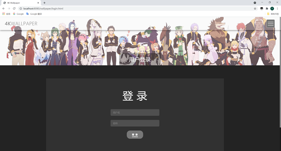

图3-3-3-1 用户登录页面

​    同注册页面大致相同，输入错误信息会有提示，登陆成功后会进入主页面并在左上角显示，用户的头像和基本信息。

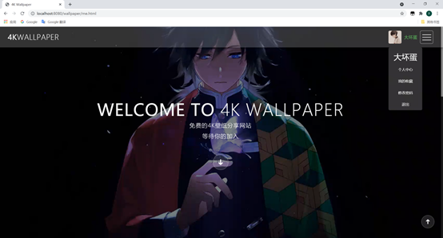

图3-3-3-2 登陆后显示页面

3.3.4 图片上传

​    用户在没有登录的状态下会提示没有登录并退出到登录页面

 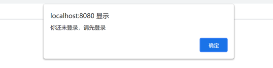

图3-3-4-1 未登录点击上传的提示信息

 	

登录的情况下就可以正常进入上传页面

 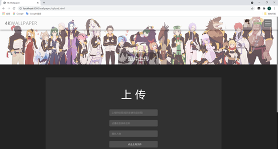

图3-3-4-2 图片上传页面

输入图片对应的相关标签动漫名称主角名称后选择图片等待上传完成即可

 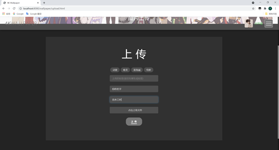

图3-3-4-3 图片上传页面

上传完成后会跳转到自己的跟人中心，在自己的个人中心即可看到上传的图片。主页面第一个图片便是刚刚上传的图片。

 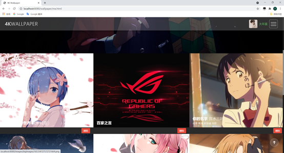

图3-3-4-4 图片上传后页面

 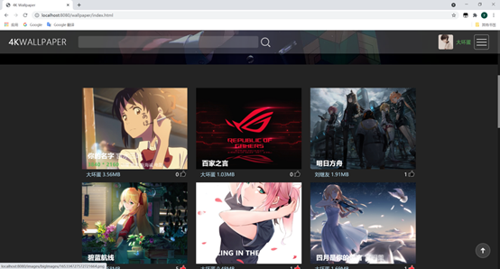

图3-3-4-5 图片上传后页面

3.3.5 收藏图片

在未登录状态下点赞是没有反应的。只有在登陆状态下才可以点击收藏按钮，并在加载图片的时候显示自己点赞过的图片。

 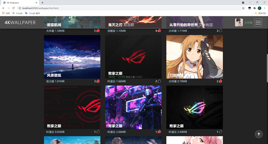

图3-3-5-1 图片点赞显示页面

点击头像下的我的收藏可以进入到我的收藏页面，点过赞的图片都会在里面显示。

 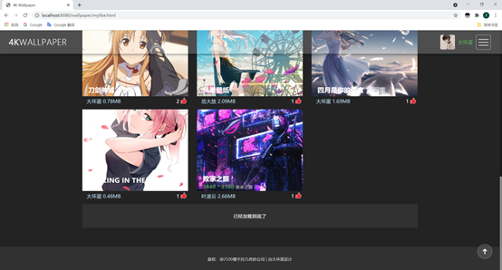

图3-3-5-2 我的收藏页面

3.3.6 个人中心

用户通过点击头向下的个人中心可以进入自己的主页面，管理自己上传的图片

 

图3-3-6-1 头像下的个人中心

 

图3-3-6-2个人中心页面

用户可以点击删除来选择自己不想要的图片。会弹框提示是否删除，点击是便可以删除图片。

 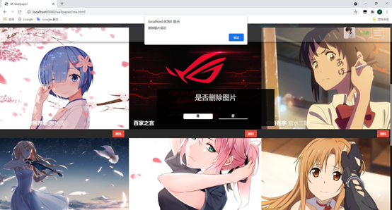

图3-3-6-3图片的删除

删除后便会刷新页面，图片便已经被删除

 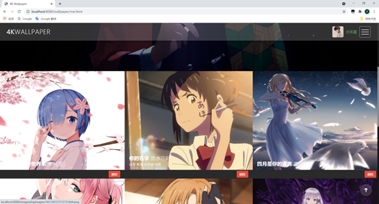

图3-3-6-4图片的删除后页面

3.3.7 最热排行

根据大家的点赞数，对图片进行优先展示

 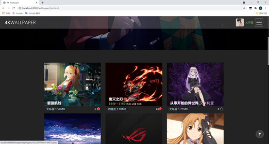

图3-3-7-1图片的最热排行页面

3.3.8 密码修改

用户登录过后即可，点击密码修改进入修改页面可以对用户名和密码都进行修改，也可以只修改一项。修改错误会有错误的提示信息

 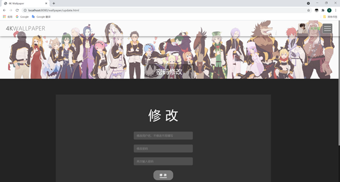

图3-3-8-1图片的最热排行页面

3.3.9 搜索功能

用户在主页面的搜索框出可以进行关键字搜索。

 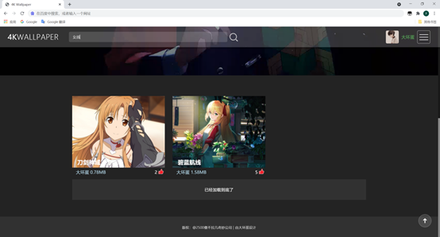

图3-3-9-1搜索功能

3.3.10 退出

用户点击退出即可一把自己的账号退出本网站

 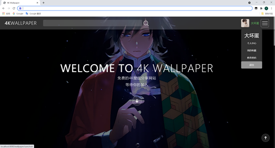

图3-3-10-1退出功能

3.3.11 关于我们

 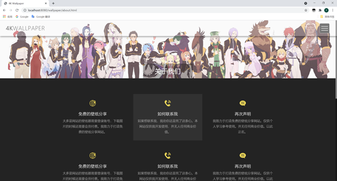

图3-3-11-1关于我们

 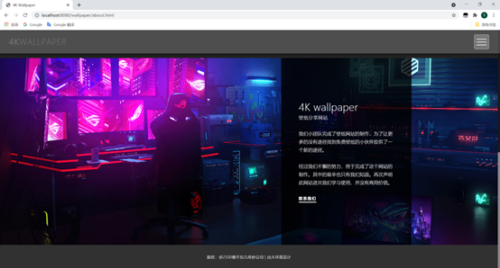

图3-3-11-2关于我们
